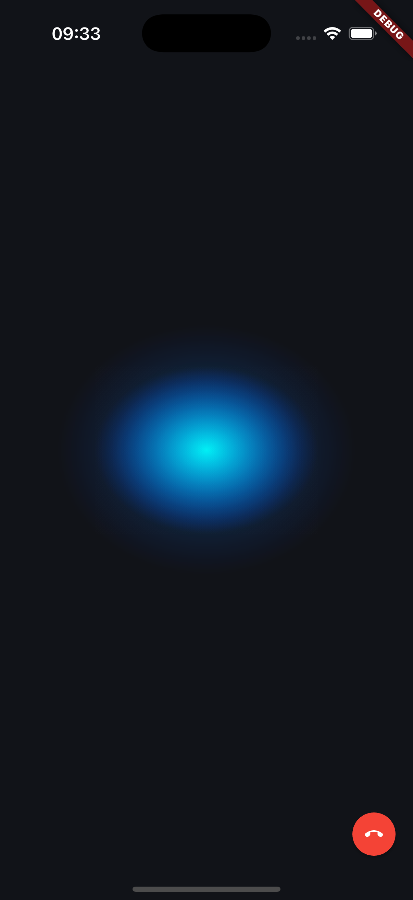

## Stream Video AI Demo Flutter

A demo Flutter app that connects to a [Node.js server](https://github.com/GetStream/openai-tutorial-node), that integrates Stream's Video SDK with OpenAI's Realtime API.

This project showcases how to build AI-powered video applications with voice interactions.

Here's a screenshot of the end result:

### What This Repository Contains

The sample code demonstrates how to use Stream's Video SDK to create video calls and connect them with OpenAI's Realtime API for AI-powered voice interactions.

This repo provides a sample app that showcases the following functionalities:
- connect to the Node.js server and fetch credentials to join a call
- add an AI agent to the call
- show beautiful visualizations of the AI audio levels

### Prerequisites

- You have followed the steps in the [Node.js server](https://github.com/GetStream/openai-tutorial-node) and you have a localhost running
    - Stream account with API key and secret
    - OpenAI API key with access to the Realtime API
- Flutter 3.27.4 or later with Xcode and/or Android Studio. 
    - For instructions on how to install FLutter, see: https://docs.flutter.dev/get-started/install
- Stream Video's Flutter SDK (0.8.3 or above for the best experience)

### Usage

After you have started the localhost, open the Flutter project and run lib/main.dart.

We are using “localhost” here (as defined in the `baseURL` property), the simplest way to test this is to run on an iOS simulator or Android emulator. On the Android emulator `10.0.2.2` points to localhost.

You can also test this on a real device, to do that you need to set `baseURL` to your local network IP address instead.

Additionally, your device and your computer should be on the same WiFi network and you need to allow “Arbitrary Loads” and “Local Networking” in your plist (the local server uses http and not https) for iOS.